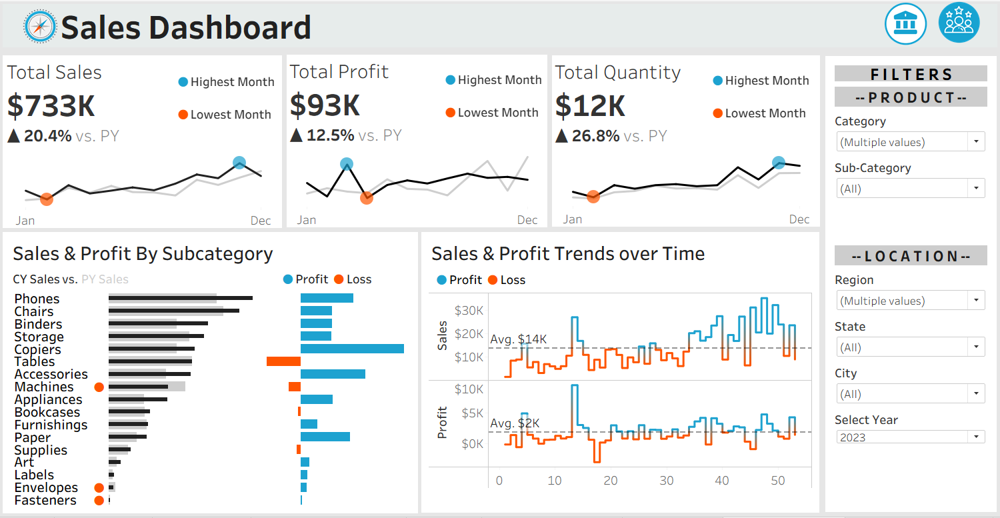
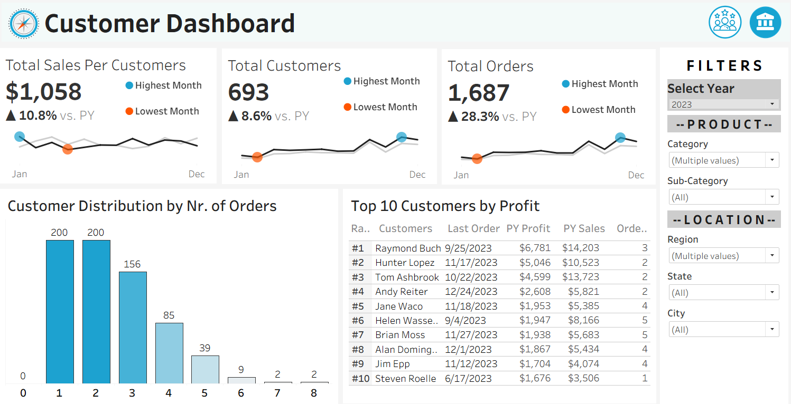

# Sales & Customer Dashboards — Tableau Project

Interactive **Tableau dashboards** analyzing **sales performance** and **customer behavior**, providing insights into **revenue trends**, **key KPIs**, and **customer segmentation** for data‑driven decision‑making.

---

## 📊 Dashboard Preview

**Sales Dashboard**


**Customer Dashboard**


---

## Dashboards Demo


---

## 🎯 Project Objectives

- Track **Sales KPIs** and performance trends over time  
- Identify top **products**, **regions**, and **customer segments**  
- Analyze **customer behavior** and contribution to revenue  
- Enable stakeholders to explore insights using interactive filters

---

## 🧰 Tools Used

- **Tableau Desktop / Tableau Public**
- Data Source: **CSV files** (included in the repository)

---

## 📁 Dataset (Included)

All required files are available in `datasets/`:

- `Orders.csv` — transactional sales data  
- `Customers.csv` — customer-level attributes  
- `Products.csv` — product catalog and details  
- `Location.csv` — geographic/location mapping  

---

## 🚀 Step-by-Step: How to Use / Run

### Step 1 — Download the repository
Clone the repo or download as ZIP from GitHub.

### Step 2 — Choose the Tableau workbook format
You have two options:

- **Recommended (portable):** `Sales & Customer Dashboards.twbx`  
  - Includes packaged resources (best for sharing).
- **Template workbook:** `SALES & CUSTOMER DASHBOARDS.twb`  
  - May require you to re-link the dataset paths.

### Step 3 — Open in Tableau
Open either `.twbx` or `.twb` using:
- **Tableau Desktop** (or Tableau Public where supported)

### Step 4 — Connect / re-link data (if prompted)
If Tableau asks for missing files:
1. Click **Edit Connection** (or **Data → [Data Source] → Edit Connection**)  
2. Point Tableau to the repo folder:
   - `datasets/Orders.csv`
   - `datasets/Customers.csv`
   - `datasets/Products.csv`
   - `datasets/Location.csv`

### Step 5 — Refresh extracts / data
- Click **Data → Refresh All Extracts** (if extracts exist), or refresh the data source.
- Confirm the visuals update without errors.

### Step 6 — Explore the dashboards
Use filters and interactions to analyze:
- **Revenue / Sales trends**
- Performance by **product** and **location**
- **Customer segmentation** and customer contribution

---

## 📌 Notes

- For easiest setup across machines, prefer the **`.twbx` packaged workbook**.
- If using `.twb`, data paths can break when moving folders—simply re-point to `datasets/`.

---

## 🗂️ Repository Structure

```
.
├── README.md
├── Sales & Customer Dashboards.twbx
├── SALES & CUSTOMER DASHBOARDS.twb
├── dashboards_demo.gif
├── sales_dashboard.png
├── customer_dashboard.png
└── datasets
    ├── Orders.csv
    ├── Customers.csv
    ├── Products.csv
    └── Location.csv
```
